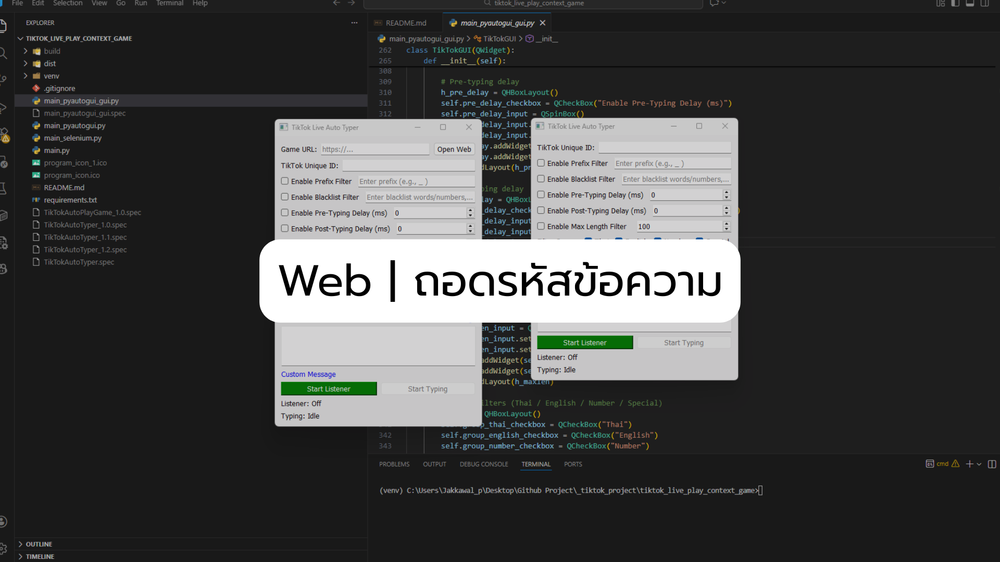
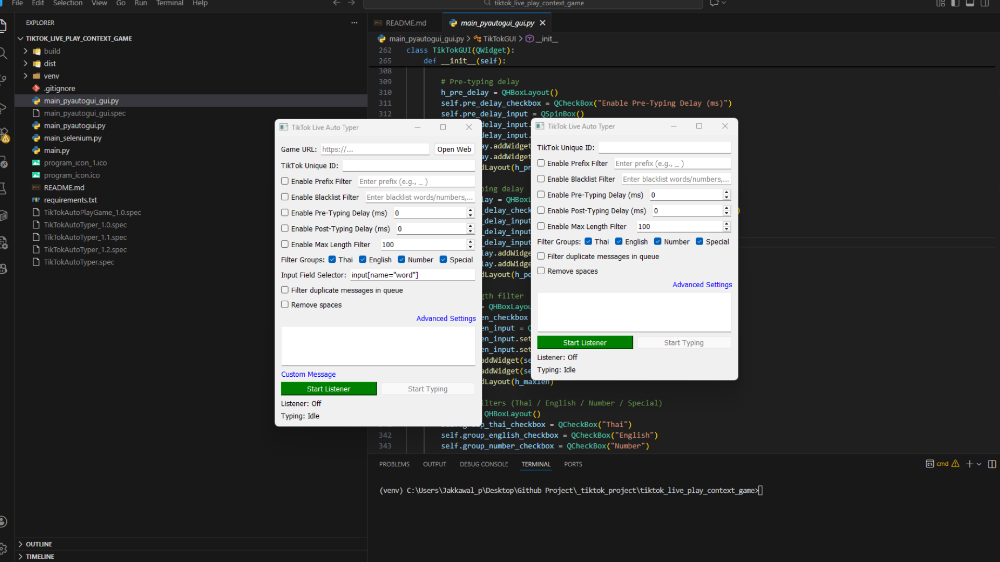
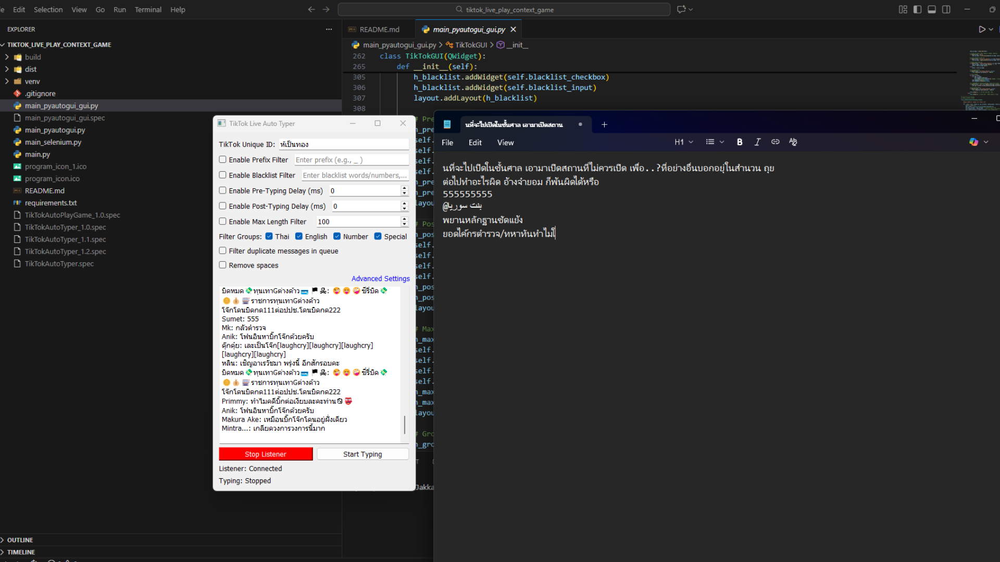
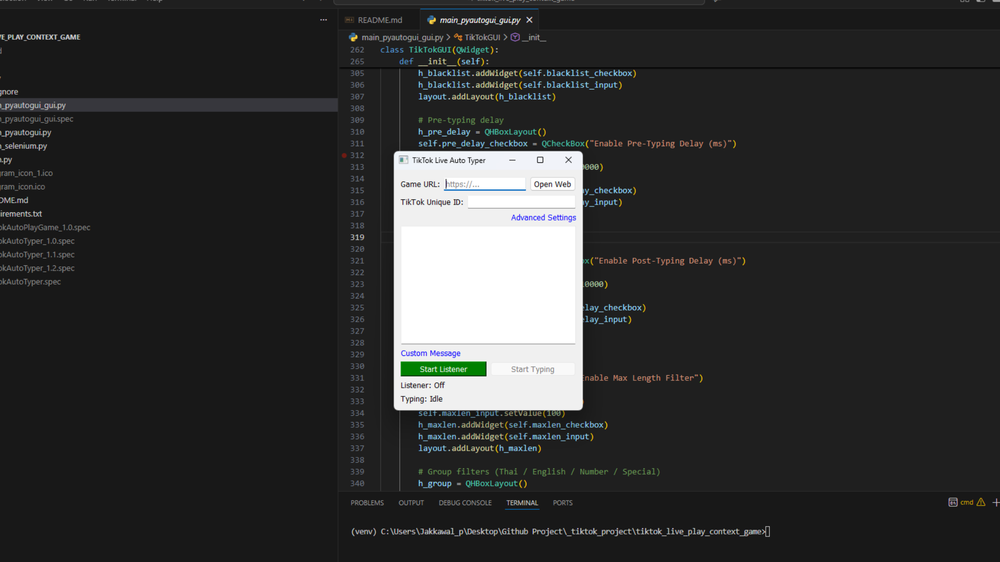
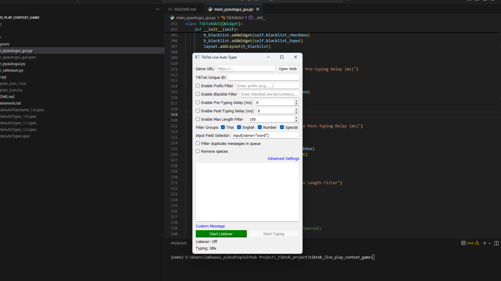
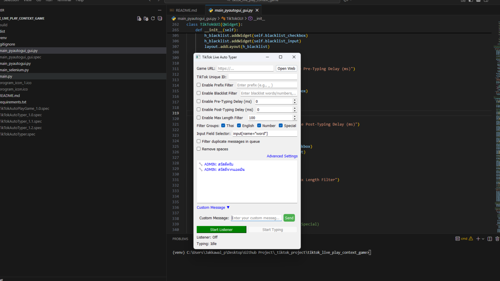
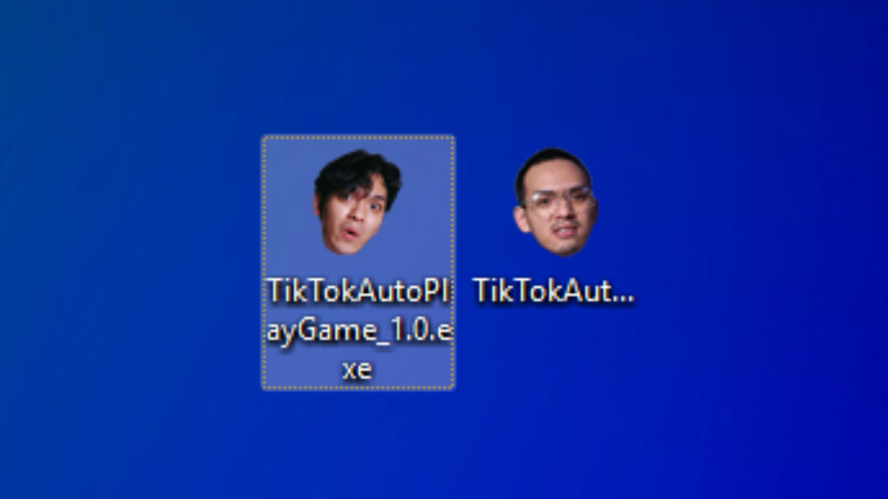

# TikTok Live → Game Input Bot

โปรเจกต์นี้ใช้สำหรับดึงข้อความจาก TikTok Live Chat แล้วส่งข้อความไปยังเกมบนเว็บ  
(สามารถเลือกได้ว่าจะพิมพ์อัตโนมัติด้วย `pyautogui` หรือควบคุม browser ด้วย `selenium`)

## ฟีเจอร์หลัก

- **รับคอมเมนต์จาก TikTok Live** แบบ real-time
- **พิมพ์อัตโนมัติ** ลงในเว็บเกมผ่าน Selenium หรือ PyAutoGUI
- **ระบบกรองข้อความ** หลากหลาย (prefix, blacklist, group filter, duplicate, max length)
- **Auto Start/Stop** เมื่อเกมเริ่ม/จบ
- **ตรวจสอบ input field** อัตโนมัติ
- **ไม่ต้องให้เมาส์อยู่ที่จอ** ตลอดเวลา
- **GUI Interface** สำหรับการตั้งค่าที่ง่าย

## วิธีติดตั้งและใช้งาน

### Windows (PowerShell)

#### 1. สร้าง Virtual Environment
```bash
python -m venv venv
```

#### 2. เข้า Virtual Environment
```bash
.\venv\Scripts\activate
```

#### 3. ติดตั้ง dependencies
```bash
pip install -r requirements.txt
```

#### 4. รันโปรแกรม Connect to live
```bash
python main.py
```

#### รันด้วย pyautogui
```bash
python main_pyautogui.py
```

#### รันด้วย pyautogui แสดง gui
```bash
python main_pyautogui_gui.py
```

#### รันด้วย selenium
```bash
python main_selenium.py
```

### macOS / Linux

#### 1. สร้าง Virtual Environment
```bash
python3 -m venv venv
```

#### 2. เข้า Virtual Environment
```bash
source venv/bin/activate
```

#### 3. ติดตั้ง dependencies
```bash
pip install -r requirements.txt
```

#### 4. รันโปรแกรม Connect to live
```bash
python main.py
```

#### รันด้วย pyautogui
```bash
python main_pyautogui.py
```

#### รันด้วย pyautogui แสดง gui
```bash
python main_pyautogui_gui.py
```

#### รันด้วย selenium
```bash
python main_selenium.py
```

## ทำเป็นไฟล์ exe

### 1. ติดตั้ง PyInstaller
```bash
pip install pyinstaller
```

### ตรวจสอบว่า install สำเร็จ
```bash
pyinstaller --version
```

### 2. สร้าง .exe (เข้าไปโฟลเดอร์โปรเจกต์)
```bash
pyinstaller --onefile --windowed --name "TikTokAutoTyper" --icon="C:\path\to\icon.ico" main_pyautogui_gui.py
```
- `--onefile` → รวมทุกอย่างเป็นไฟล์เดียว
- `--windowed` → ไม่เปิด console (เหมาะกับ GUI)
- `--name` → ชื่อไฟล์
- `--icon` → Icon

### ถ้าต้องการไอคอน
```bash
pyinstaller --onefile --windowed --icon=app_icon.ico main_pyautogui_gui.py
```

## การติดตั้ง (แบบเดิม)

1. ติดตั้ง Python 3.7+
2. ติดตั้ง dependencies:
```bash
pip install -r requirements.txt
```

3. ดาวน์โหลด ChromeDriver และใส่ใน PATH หรือโฟลเดอร์เดียวกับโปรแกรม

## การใช้งาน

1. **เปิดโปรแกรม**:
```bash
python main_selenium.py
```

2. **ตั้งค่า**:
   - ใส่ TikTok Unique ID ของสตรีมเมอร์
   - ใส่ URL ของเว็บเกม
   - เปิดเว็บเกมด้วยปุ่ม "Open Web"

3. **เริ่มเล่น**:
   - กด "Start Listener" เพื่อเริ่มรับคอมเมนต์
   - รอให้เกมโหลดเสร็จ (จะแสดง "Web Ready: Input field found")
   - กด "Start Typing" เพื่อเริ่มพิมพ์อัตโนมัติ

4. **การควบคุม**:
   - ปุ่ม "Stop Typing" หยุดการพิมพ์
   - ปุ่ม "Close Web" ปิดเว็บและหยุดการทำงาน
   - ระบบจะหยุดอัตโนมัติเมื่อเกมจบ

## ระบบกรองข้อความ

- **Prefix Filter**: กรองข้อความที่ขึ้นต้นด้วยคำเฉพาะ
- **Blacklist Filter**: กรองคำที่ไม่อยากให้พิมพ์
- **Group Filter**: กรองตามภาษา (ไทย/อังกฤษ/ตัวเลข/สัญลักษณ์)
- **Duplicate Filter**: ป้องกันการพิมพ์ข้อความซ้ำ
- **Max Length Filter**: จำกัดความยาวข้อความ

## หมายเหตุ

- ต้องมี ChromeDriver ที่เข้ากันได้กับ Chrome version ที่ติดตั้ง
- ระบบจะตรวจสอบ input field ทุก 2 วินาที
- เมื่อเกมจบ ระบบจะหยุดการพิมพ์อัตโนมัติ

## Download .exe file for windows
*   [ดาวน์โหลด TikTokAutoPlayGame_1.0.exe](https://github.com/Jakkawal23/tiktok_live_play_context_game/blob/a05cfd6f076825856cc2ffa0a787c8e51d564173/TikTokAutoPlayGame_1.0.exe)
*   [ดาวน์โหลด TikTokAutoTyper_1.2.exe](https://github.com/Jakkawal23/tiktok_live_play_context_game/blob/a05cfd6f076825856cc2ffa0a787c8e51d564173/TikTokAutoTyper_1.2.exe)

## Example web










